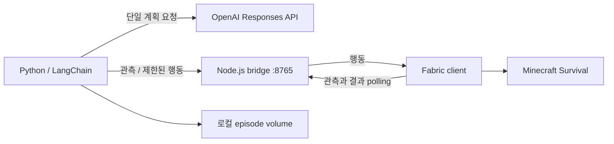

# AstraLostInAI

Minecraft Java **1.21.1 Survival**을 AI가 플레이하도록 만드는 프로젝트다.
Fabric 클라이언트 모드가 현재 플레이어의 관측과 제한된 행동을 제공하고,
별도 Docker 환경의 Python 에이전트와 Node.js 브리지가 이를 연결한다.

환경 관측, 직접 행동, Astra 단일 계획 호출, 원목 획득 스킬까지 구현했다.
자유 탐험·제작·자동 커리큘럼을 갖춘 완전한 자율 서바이벌 에이전트는 아직 아니다.
[Voyager](https://github.com/MineDojo/Voyager)의 스킬 저장·피드백·커리큘럼 개념을 참고하되
Mineflayer 대신 실제 Fabric 클라이언트를 사용한다.

## 저장소 범위

**이 Git 저장소에는 Fabric 모드와 문서가 들어 있다.** Python/Node/Docker 소스는 별도 작업 폴더에
있으며 현재 이 저장소의 Commit/Push에 포함되지 않는다. clone만으로 전체 시스템을 실행할 수는 없다.
Docker 소스의 배포·버전 관리 구조 확정은 [개발 계획](docs/ROADMAP.md)의 첫 작업이다.
문서의 `C:\Projects\AstraLostInAI`와 `C:\Docker\astralostinai`는 **예시 경로**이며 실제 위치로 바꿔 사용한다.

## 구성



| 구성 | 설정된 버전 |
|---|---|
| Minecraft / Yarn | 1.21.1 / 1.21.1+build.3 |
| Java | 21 |
| Fabric Loader / API | 0.19.5 / 0.116.17+1.21.1 |
| Kotlin / Fabric Language Kotlin | 2.4.20 / 1.14.1+kotlin.2.4.20 |
| Loom / Gradle | 1.17.20 / 9.6.1 |
| 별도 Docker Python / Node | 3.12 / 24 |

Fabric 의존성은 Gradle 설정, 별도 Docker 의존성은 requirements.lock 및 package-lock.json이 기준이다.
모델은 OPENAI_MODEL로 설정하며 현재 템플릿은 gpt-6-astra를 사용한다. API 계정의 모델 접근 권한이 필요하다.

## 실행

JDK 21을 설치하고 JAVA_HOME을 지정한다. Fabric 프로젝트를 빌드한다.

```powershell
cd C:\Projects\AstraLostInAI
.\scripts\dev.ps1 -Task build
```

별도 Docker 소스를 확보한 경우 PowerShell 7에서:

```powershell
cd C:\Docker\astralostinai
.\setup.ps1 -MinecraftConfigDirectory 'C:\Projects\AstraLostInAI\run\config'
docker compose up -d --build
.\invoke-agent.ps1 -Operation health
```

setup은 .env와 게임 설정을 생성하고 기존 파일은 보존한다. 브리지 토큰은 양쪽에서 일치해야 한다.
인증 정보가 들어 있는 게임 설정과 .env는 로컬에만 보관한다.

```powershell
cd C:\Projects\AstraLostInAI
.\scripts\dev.ps1 -Task runClient
```

서바이벌 테스트 월드에 들어가 메뉴를 닫는다. F3+P로 포커스 상실 시 일시정지를 해제하면
다른 창에서 명령을 보낼 수 있다. 메뉴·월드 전환·통신 오류 시 진행 중 제어를 중단한다.
일반 런처에서는 빌드한 모드와 Fabric API/Language Kotlin을 설치하고, setup의 설정 경로를
해당 인스턴스의 config 폴더로 지정한다.

## 행동과 목표

| 명령 | 동작 | 모델 호출 |
|---|---|---|
| observe / perception | 원본 관측 / 환경 요약 | 없음 |
| approach | 수평 4블록 이내 블록으로 평지 접근 | 없음 |
| mine | 현재 도구와 조준 대상으로 단일 블록 채굴 | 없음 |
| collect | 관측된 아이템으로 이동 후 획득 검증 | 없음 |
| wood | 최대 3행동·60초로 원목 인벤토리 증가 시도 | 없음 |
| step | 관측 → 계획 한 번 → 행동 하나 | DRY_RUN=false에서 호출 |

직접 행동과 wood는 **DRY_RUN=true여도 실제 게임에서 실행**한다.
step은 기본 DRY_RUN=true에서 관측·기록만 수행한다. 유료 실행은 .env의 OPENAI_API_KEY와
DRY_RUN 설정을 바꾸고 컨테이너에 반영한 뒤 명시적으로 요청한다. 자동 유료 반복 호출은 없다.

```powershell
cd C:\Docker\astralostinai
.\invoke-agent.ps1 -Operation perception
.\invoke-agent.ps1 -Operation wood
```

wood 성공은 result.reason=log_inventory_increased와 inventoryDelta>=1로 확인한다.
개별 행동 completed나 HTTP 200만으로 목표 달성을 판정하지 않는다.
실패 원인은 result.actionReason과 safetyFailure에서 확인한다. 원본 출력은 -FullRecord로 요청한다.
긴급 수동 중단은 게임 메뉴를 연다. 현재 stop API는 실행 중 작업을 선점하는 비상정지 API가 아니다.

서비스는 호스트 loopback 포트 8000/8765를 사용한다. health 이외 API는 bearer 인증이 필요하다.
관측은 9×6×9 로컬 블록 격자·엔티티·조준 대상·인벤토리를 포함하며 이미지 인식 기반은 아니다.

## 검증과 문서

현재 기준 Fabric 빌드와 Java 20개, 별도 agent Python 56개 테스트가 통과했다.
Node 10개 테스트는 직전 변경 시 통과했으며 이후 Node 코드는 변경하지 않았다.
실제 월드에서 동일 실패 위치의 드롭 수집과 approach→mine→collect 전체 목표 성공을 확인했다.
이는 모든 지형·서버 환경을 검증했다는 뜻은 아니다.

- [개발 계획과 완료 기준](docs/ROADMAP.md)
- [현재 진행 상태](docs/PROGRESS.md)
- [관측 규약](docs/OBSERVATION.md)
- [채굴 규약](docs/MINING.md)
- [평지 접근·수집](docs/NAVIGATION.md)
- [원목 목표와 사용자 테스트](docs/WOOD_GOAL.md)
- [이동 오류 수정 보고서](docs/NAVIGATION_FIX.md)
- [공개 저장소 포함·제외 기준](docs/PUBLISHING.md)

원본 에피소드, 월드 세이브, 개인 실행 명령 기록과 인증 정보는 공개 문서에 포함하지 않는다.
