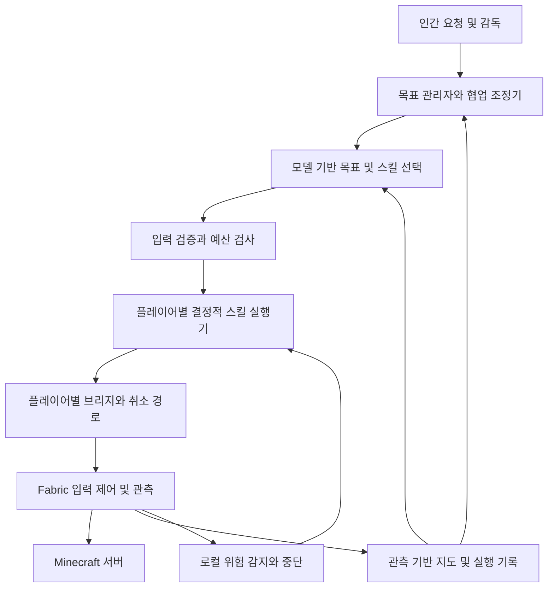

# MASTER PLAN — 엔더 드래곤 격파와 인간·AI 협업

기준일: 2026-09-12. 대상은 **Minecraft Java 1.21.1 Survival**이다.
이 문서는 최종 목표와 단계별 완료 기준을 정한다. 현재 구현 사실은 [PROGRESS](PROGRESS.md),
다음 개발 단위는 [ROADMAP](ROADMAP.md)을 따른다. 아래 미구현 기능과 수치 기준은 계획이며 달성 실적이 아니다.

## 1. 최종 목표와 성공 정의

| 목표 | 첫 완료 기준 | 후속 품질 기준 |
|---|---|---|
| G1. 단독 드래곤 격파 | 새 서바이벌 월드에서 AI가 자원 확보부터 엔드 진입·드래곤 처치까지 수행 | 사전에 고른 미학습 시드 5개 중 3개 이상 성공을 초기 목표로 두고 시드별 실패도 공개 |
| G2. 인간과 공동 작업 | 인간 1명과 AI 1명이 채집·제작·운반을 분담하고 공동 산출물을 검증 | 작업 변경·중단·접속 종료·소유권 충돌에서도 중복 작업과 자원 오사용 없이 복구 |
| G3. 여러 AI와 공동 작업 | 서로 다른 클라이언트의 AI 2개가 작업을 나누고 결과를 인계 | 인간 1명과 AI 2개 이상의 혼합 팀으로 자원 준비부터 공동 드래곤 격파까지 확장 |

G1 기본 평가 조건은 새 월드·기본 자원 없음·난이도 Normal·keepInventory=false를 제안한다.
시드·난이도·게임 규칙·모드 버전·예산은 평가 시작 전에 고정한다. 다른 조건은 별도 평가군으로 기록한다.
치트 명령, 아이템 지급, 순간이동, Creative 전환, 숨겨진 구조물 좌표 조회 없이 바닐라 상호작용으로 진행한다.
개발용 준비 월드와 장비 지급 전투 시험은 허용하지만 처음부터 끝까지의 성공 기록과 구분한다.

사람이 방향이나 행동을 지정하면 감독 실행으로 분류한다. 완전 자율 기록에서는 운영자의 기동·관찰만 허용하고,
긴급 중단·수동 복구·자원 제공이 발생하면 개입 횟수와 이유를 남긴다. 실패한 시드를 조용히 교체하지 않는다.
사망 후 자력 복구는 허용하되 사망·복구 시간·자원 손실을 기록한다. 무사망 도전은 추가 목표다.

승리는 같은 실행·월드의 드래곤 사망을 검증 가능한 게임 상태/이벤트로 확인한다.
보스바 소실이나 모델의 승리 선언만으로 판정하지 않는다. 드래곤 격파와 출구 포털을 통한 귀환은 별도 결과로 저장한다.
협동 승리는 팀 승리와 AI의 실제 기여를 구분한다. 인간이 전투를 대신 끝냈다면 단독 AI 승리로 계산하지 않는다.

## 2. 출발점과 가장 큰 차이

현재 Fabric 관측·직접 행동·단일 모델 계획·취소·wood@1.1.0 등록과 실행이 있다.
wood는 최대 3행동/60초, 수평 4블록과 발 높이 +2블록의 후보를 사용한다.
운영 기록에서 원목 획득 성공을 확인했지만, 수집 반경 확대와 대체 후보 분기의 실게임 검증은 남아 있다.

아직 없는 핵심은 제작·장비 조작, 식량/회복, 전투, 입체·장거리 경로, 지속 지도, 차원 이동,
장시간 목표 실행·복구, 다중 클라이언트 식별과 작업 조정이다.
단일 모델 호출의 성공을 이 기능들의 구현으로 간주하지 않는다.
기존 3행동 제한을 무작정 키우는 대신 짧은 스킬을 검증하며 상위 목표로 연결한다.

## 3. 목표 아키텍처

| 계층 | 책임 | 구현 방향 |
|---|---|---|
| Fabric 제어 | 매 틱 이동·조준·채굴·공격·아이템 사용, 위험 시 입력 해제 | 모델 응답을 기다리지 않는 짧은 상태 기계 |
| Node 브리지 | 클라이언트 인증·행동 전달·중복 방지·취소 확인 | 먼저 기존 단일 클라이언트 격리 유지, 이후 플레이어별 라우팅 |
| Python 실행기 | 스킬 검증·실행·성공 판정·시간/행동 예산·복구 | 재시작 후 복구 가능한 실행 상태와 버전 기록 |
| 목표 계획 | 자원 의존성, 우선순위, 다음 스킬 선택 | 결정적 기본 계획을 먼저 검증하고 모델 선택을 그 위에 추가 |
| 지도와 기억 | 직접 관측한 지형·거점·위험·자원 및 관측 시각 | 미관측 공간은 unknown, 과거 사실은 재검증 |
| 협업 조정 | 역할·작업 할당·예약·인계·권한·팀 예산 | 신뢰할 수 있는 구조화 명령과 채팅 내용을 분리 |
| 평가기 | 진행·실패·비용·개입·승리 검증 | 실행기와 독립된 검증 자료, 모델 자연어 평가에 의존하지 않음 |

현재 로컬 구조화 관측을 기본으로 유지한다. 화면 인식은 GUI나 관측 누락을 해결할 필요가 생길 때 보조 수단으로 추가한다.
지도는 시드 역산이나 미로드 청크 조회가 아니라 이동하며 얻은 관측으로 만든다.
검증용 서버 계측을 도입하면 그 자료가 플레이어 계획에 유입되지 않도록 평가 경로를 분리한다.

## 4. 단독 플레이의 단계별 과정

단계마다 코드·스킬 규약·합성 회귀·실게임 기록·문서를 함께 납품한다.
완료 기준을 충족하기 전 다음 단계의 장시간 자율 실행을 켜지 않는다.

| 단계 | 기능과 주요 작업 | 의존성 | 통과 기준 |
|---|---|---|---|
| S0. 실행 기반 고정 | 현재 재탐색 분기 검증, capability/관측 버전 협상, 취소·사망·재접속 검사 | 현재 코드 | 의도한 분기를 실게임 재현하고 오래된 명령의 재실행·취소 오인 없음 |
| S1. 인벤토리와 제작 | 슬롯 선택, 도구 장착, 아이템 사용, 2×2/3×3 제작, 작업대 설치·접근, 상자 입출고 | S0 | 원목→판자→작업대→나무 도구→돌 도구; 재료 감소와 산출물 증가 일치 |
| S2. 이동·지도·거점 | 1블록 단차, 안전한 내려가기, 수영, 구간별 경로, 배치·굴착, 횃불·침대·귀환 위치 | S0, 배치는 S1 | 다른 지형의 자원 지점 왕복, 길 막힘 재계획, 미로드/낙하 위험에서 중단 |
| S3. 생존 유지 | 식량 획득·조리·먹기, 체력·허기 우선순위, 야간 대피, 사망·리스폰·장비 회수 | S1, S2 | 제안 기준 30분×3회 생존 시험; 긴급 회복·대피·사망 복구를 각각 검증 |
| S4. 장비와 일반 전투 | 광물 채굴·제련, 철 도구/방어구/방패/물 양동이, 근접 공격·막기·활 조준·후퇴 | S1–S3 | 준비 전투장에서 대상별 승패 검증, 도구 파손·탄약 부족·다수 적에 후퇴 |
| S5. 장시간 목표 관리자 | 자원 의존 그래프, 식량/도구 예비량, 체크포인트, 실패 분류, 모델 호출 예산 | S1–S4 | 채집→제련→장비 제작→보급을 개입 없이 연결, 프로세스 재시작 후 상태 대조·재개 |
| S6. 네더 왕복과 재료 | 포털 건설·점화, 차원별 지도, 귀환 경로, 네더 탐색·블레이즈 전투·막대 획득 | S2–S5 | 오버월드에서 준비해 네더 재료를 얻고 귀환; 포털 재진입 및 자원 부족 복구 |
| S7. 엔더의 눈과 요새 | 엔더 진주 확보, 블레이즈 가루·눈 제작, 투척 방향 관측, 장거리 이동, 요새·포털 방 탐색 | S5, S6 | 숨겨진 좌표 없이 요새 도달; 사용·분실·회수·프레임 충전량을 추적하며 포털 활성화 |
| S8. 엔드 전투 단위 스킬 | 진입 지형 확보, 공허 회피, 크리스털 공략, 드래곤 단계 관측·공격·회복·후퇴 | S3, S4; 전체 진입은 S7 | 준비된 시험 월드에서 각 전투 스킬과 드래곤 처치 확인; 장비 지급 사실 명시 |
| S9. 전체 자율 격파 | 새 월드에서 S1–S8 연결, 사망 복구, 전투 실패 후 재보급, 최종 승리 판정 | S5–S8 | G1의 첫 성공 후 고정된 미학습 시드 평가와 비용·개입 보고서 작성 |

S1과 S2는 작은 단위로 교차 구현한다. S8의 준비 전투장 시험은 S4 이후 먼저 시작할 수 있으나,
그 성공이 S6·S7의 자연 진행을 대체하지 않는다.

### 자원과 게임 진행의 의존 관계

기본 경로는 원목·돌 도구 → 식량/철 장비 → 네더 진입 → 블레이즈 재료와 엔더 진주 → 엔더의 눈 → 요새 → 엔드다.
엔더의 눈은 요새 탐색과 포털 활성화에 쓰이며 엔더 진주와 블레이즈 가루를 필요로 한다.
포털 프레임 충전뿐 아니라 탐색 중 소모까지 고려해 여유분을 계산한다.
이 진행 관계는 [Minecraft 공식 Stronghold 안내](https://www.minecraft.net/en-us/article/stronghold)를 참고했다.

진주 획득은 엔더맨 사냥을 기본 구현 후보로 두고 거래·교환 경로는 별도 스킬로 비교한다.
네더 진입의 흑요석 확보 방식, 장비 등급, 물약 사용은 안정성과 구현 비용을 실험해 정한다.
다이아몬드 풀세트·인챈트·자동 농장은 첫 격파의 필수 전제에 넣지 않는다.

첫 드래곤 전투는 활·근접 공격·회복·안전 이동을 기본 전략으로 설계한다.
침대 폭발 등 특수 공략은 추가 평가군으로 두어 첫 구현에 전략적 복잡성을 더하지 않는다.
크리스털 폭발 거리, 철창 접근, 드래곤 돌진·착지·넉백, 엔더맨 적대, 낙하 상황을 따로 검증한다.
실제 공격 판정·GUI 동기화·차원 전환 세부 동작은 1.21.1 코드와 실게임에서 확인하고 버전별 회귀로 고정한다.

## 5. 장시간 실행에 필요한 공통 규약

### 스킬과 실행 기록

각 스킬은 ID·버전·입력 스키마·필요 capability·선행 조건·완료 증거·실패 이유·취소 처리·예산을 가진다.
이동·채굴·공격·제작처럼 상태를 바꾸는 요청에는 실행 ID와 대상 스냅샷 버전을 연결한다.
재접속이나 응답 유실 후 같은 제작·아이템 전달을 재실행하기 전에 현재 인벤토리와 결과를 대조한다.
네트워크의 완전한 exactly-once 실행을 가정하지 않고, 중복 억제와 증거 기반 대조로 복구한다.

현재 실행 메모리는 재시작으로 사라진다. S5에서는 SQLite 등 트랜잭션 저장소에 목표·단계·예산·
마지막 확인 상태를 보존하고 JSONL은 분석용 이력으로 남기는 방안을 우선 검토한다.
학습·스킬 개선은 실패 기록 분석→수정 제안→격리 시험→버전 등록 순으로 한다.
임의 생성 코드의 즉시 실행이나 자동 배포는 첫 드래곤 격파의 필수 기능이 아니다.

### 예산과 긴급 반응

행동 수, 벽시계 시간, 재시도, 모델 호출 수, 토큰 사용량에 스킬·개체·팀·전체 실행별 상한을 둔다.
원목 스킬의 3행동/60초는 그 스킬의 규약으로 유지하고, 장시간 목표는 여러 짧은 실행을 연결한다.
최종 실행의 구체적 비용 상한은 실제 계정의 사용량과 측정한 단계별 비용으로 설정한다.
모델 가격이나 호출 지연을 상수로 가정하지 않는다. 비용 상한·네트워크 장애가 발생하면 안전한 대기/중단 상태로 전이한다.

모델은 자원 확보 순서와 다음 스킬을 고른다. 투사체 회피·낙하 대응·공격 타이밍·즉시 회복 같은
짧은 반응은 Fabric 또는 로컬 제어기가 담당한다. 관측 노후화와 서버 지연을 함께 측정해 실행 여부를 판단한다.

## 6. 멀티플레이 협업 과정

협업 개발은 G1 완료 뒤에 시작할 필요가 없다. S1–S3의 채집·제작·이동이 안정되면 M0–M2를 병행한다.
초기에는 관리 가능한 1.21.1 전용 테스트 서버를 사용한다. 서버 접근 권한과 클라이언트별 계정 준비는 별도 환경 작업이다.
인간이 AI를 돕는 평가와 인간 없이 여러 AI만 수행하는 평가는 분리한다.

| 단계 | 구성과 기능 | 의존성 | 완료 기준 |
|---|---|---|---|
| M0. 서버 호환 | 원격 서버에서 단일 Fabric AI, 지연·리스폰·차원 전환·접속 종료 | S0–S2 | 같은 기본 스킬이 서버 확정 상태로 판정되며 서버와 클라이언트 상태 불일치를 복구 |
| M1. 인간+AI 작업 | 인간 요청의 구조화, 범위·수량·납품 지점, 수락/진행/완료/중단, 따라가기·합류 | M0, S1–S3 | 인간이 나무를 요청하면 AI가 정해진 수량을 전달하고 양쪽 수량 변화 확인 |
| M2. AI+AI 분업 | 개체별 실행기, 공유 작업판, 역할·자원 예약, 상자 인계, 충돌·중복 채집 방지 | M0, S1–S3 | 채집 AI와 제작 AI가 공동 산출물을 만들고 담당 접속 종료 시 남은 작업을 인계 |
| M3. 혼합 팀 임무 | 인간+복수 AI, 우선순위 변경, 대피·구조·호위·보급, 공유 지도 | M1, M2, S4–S6 | 원정 도중 역할 변경·장비 손실·한 개체 이탈에도 팀 목표를 재계획 |
| M4. 공동 드래곤 격파 | 자원 분담, 포털 집결, 전투 역할, 팀 체력·탄약·부활·복귀 계획 | M3, S7–S9 | 드래곤 사망과 개체별 기여·사망·개입·비용 기록; 팀 승리와 단독 능력 구분 |

### 다중 클라이언트 구조

현재 브리지는 관측·세션·pending 행동이 한 개이고 Python도 단일 실행 잠금을 사용한다.
클라이언트를 추가 연결하는 것만으로 여러 AI가 되지 않는다.

초기 M2는 AI마다 Fabric 클라이언트와 agent/bridge 인스턴스를 분리하고, 상위 조정기가 작업만 할당한다.
이 방식으로 기존 취소와 큐의 격리를 유지한 뒤 필요하면 멀티플렉싱으로 확장한다.
공통 식별자는 serverId/worldId/dimension/agentId/playerId/sessionId/executionId/taskId로 설계한다.
새 session에서 오래된 행동·예약을 자동 재사용하지 않는다. 한 플레이어의 입력 소유자는 항상 하나다.

여러 Fabric 클라이언트의 CPU·메모리·화면/포커스 요구를 먼저 측정한다.
현재 runClient 기반 실험이 여러 무인 클라이언트의 안정적인 배포를 뜻하지 않는다.
AI 한 개체 중단이 다른 개체의 게임 제어를 멈추지 않도록 실행기·토큰·로그를 격리한다.
공유 키 하나를 모든 플레이어의 제어 권한으로 사용하지 않는다.

### 작업과 자원 소유권

작업 상태는 제안→수락→예약→진행→검증→완료로 관리하고 취소·실패·만료를 별도로 둔다.
작업마다 요청자·담당자·대상 영역·수량·납품 위치·기한·버전·완료 증거를 기록한다.
예약에는 만료 시간과 갱신을 두며 이탈한 개체의 작업은 현재 월드 상태를 확인한 뒤 재할당한다.

상자·작업대·광맥·좁은 통로는 필요에 따라 단기 예약한다. 인간의 직접 조작은 예약을 따르지 않을 수 있으므로
실제 슬롯·블록 상태가 다르면 중단 후 다시 계산한다. 예약만으로 Minecraft 상태가 잠기는 것은 아니다.
아이템 전달은 준 쪽의 감소와 받은 쪽의 증가를 함께 확인하고, 분실·부분 전달·다른 플레이어의 수령을 구분한다.
공유 지도 정보에는 관측자·시각·차원·확인 수준을 붙여 오래된 정보나 동료의 추측을 확정 사실로 취급하지 않는다.

### 인간 지시와 권한

게임 채팅·책·표지판은 관측 데이터다. 임의 플레이어가 쓴 문장을 제어 권한으로 취급하지 않는다.
등록된 요청자와 명시적 명령 채널을 통해 작업을 수락하고, 작업 범위와 대상 자원을 확인한다.
상자 소유권·보호 구역·대인 공격 금지·건축물 철거 범위를 서버 운영 정책으로 정한다.
인간의 긴급 정지는 최우선으로 처리하고, 개인 중단과 팀 전체 중단을 구분한다.
자연어 대화가 길어져도 작업 ID와 현재 합의는 구조화 상태로 유지한다.

## 7. 평가·보고 체계

| 시험 층 | 내용 | 실행 위치 |
|---|---|---|
| 단위·합성 | 자원 계산, 경로, 상태 전이, 취소·중복, 권한·예약·버전 오류 | 기존 CI 확장; 모델·실제 월드 없음 |
| 게임 통합 | 준비된 지형·장비·적·GUI·포털, 서버 확정 이벤트 | 별도 1.21.1 시험 환경; 초기에는 수동 실행 |
| 장시간 단독 | 새 월드에서 단계 목표와 전체 격파 | 고정 조건·시드·예산, 중단/개입 이력 포함 |
| 협업 | 동시 접근, 부분 전달, 이탈, 인간 상태 변경, 역할 교체 | 통제된 전용 서버 |
| 장애 주입 | 패킷/응답 지연·유실, 프로세스 재시작, 사망, 인벤토리 부족 | 재현 가능한 별도 시나리오 |

첫 완료와 반복 신뢰도를 따로 보고한다. 개발 시드와 평가 시드를 분리하고 결과를 본 뒤 표본을 바꾸지 않는다.
각 핵심 스킬의 초기 품질 목표는 대표 조건 10회 중 9회 성공을 제안하되,
위험을 탐지해 올바르게 멈춘 시험은 안전 시험으로 별도 집계한다. 이 수치는 통계적 보장을 뜻하지 않는다.

필수 보고 지표는 성공률·실패 단계·걸린 시간·행동/재시도 수·모델 호출/토큰·비용·사망·개입이다.
협업은 중복 작업·인계 불일치·대기 시간·예약 충돌·개체별 기여를 추가한다.
팀 전체 원목 증가는 특정 AI가 수집했다는 증거를 대신하지 않는다.
원본 월드·계정·채팅·좌표는 로컬 자료로 보관하고 공개 회귀에는 합성 또는 비식별 최소 재현을 사용한다.

## 8. 위험과 대응

| 위험 | 먼저 확보할 대응 |
|---|---|
| 멀리 있거나 높은 자원을 못 고름 | 후보 제외 이유를 세분화하고 탐색·도달 스킬을 따로 추가; 범위 숫자만 늘리지 않음 |
| 모델 판단이 전투보다 늦음 | 짧은 로컬 제어, 전투 전 계획, 긴급 회복/중단 우선순위 |
| 여러 시간 실행 중 상태가 사라짐 | 체크포인트·현재 상태 대조·중복 부작용 방지 |
| 죽음·차원 이동으로 지도와 행동이 낡음 | 세션·차원별 무효화, 재보급 계획, 귀환 경로 기록 |
| 후보 재시도로 비용과 위험이 증가 | 스킬과 전체 목표의 공통 예산, 금지 실패 유형, 재시도 상한 |
| 여러 AI가 같은 자원을 가져감 | 예약·작업 버전·인계 증거, 서버 실제 상태와 재조정 |
| 특정 시드만 성공 | 개발/평가 시드 분리, 실패 포함 결과 보고 |
| 일반 문서와 1.21.1 동작 차이 | 구현 시 해당 버전의 코드·레시피·실게임 확인을 통과 조건에 포함 |

## 9. 바로 다음 작업과 개발 순서

1. S0 마무리: 수집 search.passes=2, 대체 후보, 재탐색 중 취소를 실게임 재현하고 이번 변경의 CI 확인.
2. S1 첫 구현: 슬롯 선택→2×2 판자 제작→작업대 제작·설치→3×3 나무 도구 제작. 각 단계에 재료/산출물 검증.
3. S2 첫 구현: 안전한 1블록 이동과 짧은 왕복 경로, 후보 제외 사유의 구체적 진단.
4. S3 첫 구현: 먹기·식량 보급·저체력 중단을 상위 목표보다 우선하도록 연결.
5. M0 착수: 동일 기본 스킬을 전용 서버에서 검증하고 개체 식별 규약을 확정.
6. 이후 S4–S9를 주 경로로 진행하고 M1–M4를 공통 기반의 완료 상태에 맞춰 병행.

달력 일정은 아직 확정하지 않는다. 단계별 실제 성공률·구현량·실게임 시험 시간을 측정한 뒤 산정한다.
가장 먼저 증명할 장기 이정표는 첫날 생존과 돌/철 장비 확보, 다음은 네더 재료 왕복,
그다음은 엔드 도달과 준비 전투, 마지막은 새 월드에서의 전체 격파다.

실제 구현 시 각 단계의 범위·예산·검증 결과를 ROADMAP과 PROGRESS에 반영한다.
