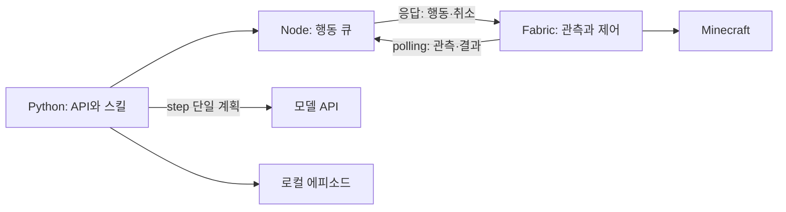

# 프로젝트 분석과 진행 상태

기준일: 2026-09-25. 현재 작업 트리(미커밋 `craft_tool` 구현 포함)를 기준으로 분석했다.
구현은 소스, 자동 검증은 실행 결과, 실게임 확인은 기존 문서에 기록된 사용자 보고를 구분한다.
이번 분석에서는 실제 월드나 유료 모델을 실행하지 않았다.

## 목적과 현재 위치

Minecraft Java 1.21.1 Survival에서 실제 Fabric 클라이언트를 제어해 최종적으로 엔더 드래곤을 격파하고,
인간·다른 AI와 협업하는 것이 목표다. 현재는 **기본 행동과 짧은 결정적 스킬을 검증하는 초기 단계**다.
전체 계획의 S0(실행 기반)와 S1(인벤토리·제작)에 해당하며 두 단계 모두 잔여 작업이 있다.
자유 탐험, 생존 유지, 전투, 차원 이동, 장시간 자율 목표 관리와 협업은 아직 구현되지 않았다.

## 구조와 근거

| 계층 | 현재 책임 | 주요 소스 |
|---|---|---|
| Fabric / Kotlin | 관측, 매 틱 행동 제어, 월드·화면 변화 시 중단 | [클라이언트](../src/client/kotlin/org/wwgs/astralostinai/client/AstralostinaiClient.kt), 같은 폴더의 Controller·EnvironmentObserver |
| Java / Mixin | 경로·증거 계산과 서버 슬롯·획득 이벤트 수신 | [공통 로직](../src/main/java/org/wwgs/astralostinai/), [Mixin](../src/client/java/org/wwgs/astralostinai/mixin/client/) |
| Node bridge | 인증, 단일 클라이언트 관측·행동 큐, 결과·취소 전달 | [server.mjs](../docker/bridge/server.mjs) |
| Python agent | API·실행 잠금·단일 모델 계획·스킬·에피소드 기록 | [app.py](../docker/agent/app.py), [skills.py](../docker/agent/skills.py), [wood_goal.py](../docker/agent/wood_goal.py), [tool_goal.py](../docker/agent/tool_goal.py) |
| 실행·검증 | 버전 고정 빌드, 격리 Docker 시험, CI | [Gradle](../build.gradle.kts), [스크립트](../scripts/), [CI](CI.md) |

관측은 이미지가 아닌 로드된 로컬 게임 데이터다. 블록 9×6×9와 엔티티·조준·인벤토리를 사용한다.
Python과 브리지는 단일 실행/클라이언트 구조이며, 실행 상태는 메모리·이력은 JSONL로 관리한다.
재시작 복구와 다중 AI 조정이 가능한 구조까지 완성된 것은 아니다.

## 기능별 상태

| 기능 | 구현·검증 상태 | 남은 범위 |
|---|---|---|
| 관측·직접 행동·단일 모델 step | 구현, 기존 실게임 확인 기록 | 자동 목표 선택·반복 실행 없음 |
| 채굴·평지 접근·수집 | 구현, 기존 실게임 성공 기록 | 수평 4블록·동일 높이 평지; 점프·장거리 없음 |
| 취소 | 구현, 자동 시험 및 기존 사용자 확인 | 모든 통신·완료 경합 조건의 실게임 검증은 아님 |
| wood@1.1.0 | 구현, 기존 기록 5건 중 성공 3·범위 밖 종료 2 | 최대 3행동/60초, 원목 발 높이~+2 |
| 수집 반경 확대·대체 후보 | 구현·합성 검증 | search.passes=2 및 대체 후보 분기 실게임 확인 |
| 핫바 선택·교환, 2×2 제작, 작업대 설치·나무 도구 제작 | 구현, 기존 사용자 성공 보고 | 원목부터 장착까지의 전체 자동 연결 |
| 돌 도구 5종 | 구현·자동 검증 | 기존 문서의 실게임 상태가 상충하여 별도 확인 필요 |
| craft_tool@1.0.0 | 미커밋 구현·자동 검증 | 성공 규약·실패 처리 보완과 실게임 검증 |
| 지도·식량·전투·목표 관리자·협업 | 미구현 | [전체 계획](MASTER_PLAN.md) |

## 분석 결과와 우선 보완점

강점은 실행 예산·capability·취소를 행동 전송 경로에 두고, 수집과 제작에 별도 성공 증거를 요구한다는 점이다.
Java의 계산 로직, Python의 목표 흐름, Node의 전송 규약과 합성 연결 시험이 분리되어 회귀 검증이 가능하다.
다음 병목은 모델 성능보다 **스킬의 일관된 규약과 자원 준비부터 장착까지의 연결**이다.

`craft_tool`에서 확인한 구체적인 차이는 다음과 같다. 코드 수정은 이번 문서 정리에 포함하지 않았다.

- `tool_goal.py`가 자체 `GoalHalt`를 정의하지만 `app.py`와 `skills.py`는 `wood_goal.GoalHalt`만 잡는다.
  재료 부족 등 도구 스킬의 중단이 의도한 구조화 결과 대신 처리되지 않은 예외로 이어질 수 있다.
- `skill-check`는 입력을 받지 않고 기본 나무 곡괭이·슬롯 0으로 검사한다. 돌 도구 실행의 사전 검증을 대신하지 않는다.
- 이미 손에 든 도구도 성공이고, 다른 핫바 슬롯의 도구는 그 슬롯을 선택한다. 신규 제작·지정 슬롯 이동을 항상 보장하지 않는다.
- 성공 검증은 장착 상태와 완화된 수량 조건을 사용한다. `tool_crafted_and_equipped`라는 이름만으로 도구 순증가를 단정할 수 없다.
- 작업대를 격자에서 찾는 대체 경로는 있으나 자동 접근·조준은 없다. 실제 제작기는 조준을 요구하므로 조회 통과 후 실행이 거절될 수 있다.
- Fabric의 돌 재료 판정은 태그도 허용하지만 Python 사전 계산은 조약돌·심층암 조약돌·흑암 목록이다. 데이터팩 확장 시 불일치 가능성이 있다.

## 검증과 해석

2026-09-25 격리 Docker 재실행: Python **146개**, Node **26개**, 합성 관측·행동 전달·취소 왕복 통과.
보고서 회수와 시험 컨테이너·네트워크 정리도 통과했다. Python 의존성에서 deprecation 경고 1건이 있었다.
Fabric build도 성공했다. Java test 태스크는 UP-TO-DATE로 기존 결과를 재사용했다(로컬 JUnit XML 집계 기준 39개). 원격 CI와 실게임은 이번에 재실행하지 않았다.

기존 실게임 보고는 채굴·수집·취소·제작의 특정 조건 성공 근거이며 전체 환경의 신뢰도 지표는 아니다.
특히 기존 stone 문서는 미검증, PROGRESS 일부 문구는 나무/돌 통합 성공으로 읽혀 돌 도구는 확인 필요로 분류했다.
HTTP 200, 행동 completed, 블록 파괴, 아이템 획득, 목표 달성을 구분한다.

다음 작업과 완료 기준은 [ROADMAP](ROADMAP.md), 명령·증거 규약은 [문서 안내](README.md)를 따른다.
